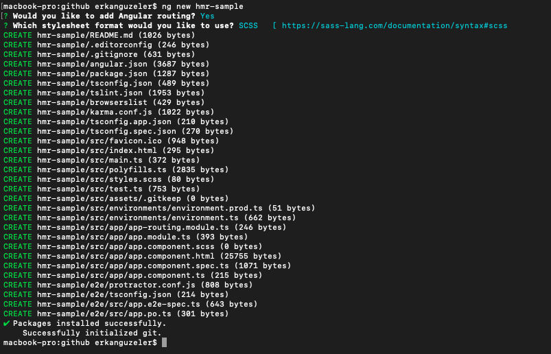
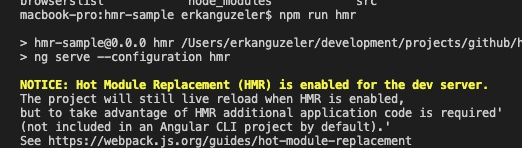

# HMR Hot Module Replecament

Hi everyone,

In this article, I would like to show you how to implement HMR-Hot Module Replecament to your Angular project.

When developing a project with Angular's default configurations, whenever you saved your project(`Ctrl+S`) the project is recompiled. The whole project recompiled. This situation may cause time loss when developing.

At this moment, I did some research, and I found HMR to decrease recompilation for Angular.

## Create New Project

Let's begin to create a new project with angular-cli like below command.

    ng new hmr-sample

The output is like below image.



Successfully created a project and you also run with 

    ng serve --open

command.

## What is HMR (Hot Module Replacement)

Hot Module Replacement(HMR) is a feature of Webpack. The HMR updates your angular project without whole project recompile and reload.

You also check it out [this](https://webpack.js.org/guides/hot-module-replacement/) website for more information about HMR.


Let's go to implementations.

Firstly we need to add a new enviroment to use HMR.

### Environment for HMR

Add a file to `src/environments/environment.hmr.ts` and insert below contents.

```typescript
export const environment = {
 production: false,
 hmr: true
};
```

After added above file, we need to update `src/environments/environment.prod.ts` and add the 'hmr' property like below.

```typescript
export const environment = {
 production: true,
 hmr: false
};
```

After added above contents we need to update default environment(`src/environments/environment.ts`) properties like below context.
```typescript
export const environment = {
 production: false,
 hmr: false
};
```

After adding to environments this contents we should update `angular.json` file. We will enable hmr when the project build and serve. Add below contents to your `angular.json` file.


```json
  "build": {
    "configurations": {
      ...
      "hmr": {
        "fileReplacements": [
          {
            "replace": "src/environments/environment.ts",
            "with": "src/environments/environment.hmr.ts"
          }
        ]
      }
    }
  },
  ...
  "serve": {
    "configurations": {
      ...
      "hmr": {
        "hmr": true,
        "browserTarget": "<project-name>:build:hmr"
      }
    }
  }
```

Please attention this, the `<project-name>` is your project name. My project name is `hmr-sample.`

We should add types to `src/tsconfig.app.json` as `node`.

```json
{
  ...
  "compilerOptions": {
    ...
    "types": ["node"]
  },
}
```

After above configuration you should use HMR with below command.

    ng serve --configuration hmr

If you would like to add shortcut you should add to your `package.json` below contents.

```json
"scripts": {
  ...
  "hmr": "ng serve --configuration hmr"
}
```

After adding above configuration to project, we should add @angularclass/hmr module as a dev-dependency.
 
    $ npm install --save-dev @angularclass/hmr
 

Create a file called `src/hmr.ts` with the following content:

```typescript
import { NgModuleRef, ApplicationRef } from '@angular/core';
import { createNewHosts } from '@angularclass/hmr';

export const hmrBootstrap = (module: any, bootstrap: () => Promise<NgModuleRef<any>>) => {
  let ngModule: NgModuleRef<any>;
  module.hot.accept();
  bootstrap().then(mod => ngModule = mod);
  module.hot.dispose(() => {
    const appRef: ApplicationRef = ngModule.injector.get(ApplicationRef);
    const elements = appRef.components.map(c => c.location.nativeElement);
    const makeVisible = createNewHosts(elements);
    ngModule.destroy();
    makeVisible();
  });
};
```
After added above contents to your `src/hmr.ts`file, we need to update our `src/main.ts`file like below contents.

```typescript
import { enableProdMode } from '@angular/core';
import { platformBrowserDynamic } from '@angular/platform-browser-dynamic';

import { AppModule } from './app/app.module';
import { environment } from './environments/environment';

import { hmrBootstrap } from './hmr';

if (environment.production) {
  enableProdMode();
}

const bootstrap = () => platformBrowserDynamic().bootstrapModule(AppModule);

if (environment.hmr) {
  if (module[ 'hot' ]) {
    hmrBootstrap(module, bootstrap);
  } else {
    console.error('HMR is not enabled for webpack-dev-server!');
    console.log('Are you using the --hmr flag for ng serve?');
  }
} else {
  bootstrap().catch(err => console.log(err));
}
```

After added above contents to our project, we have finished implementation of HMR to our Angular project. You easily run your app with below command.

    $ npm run hmr


You will see the a message about HMR is enable like below in your terminal.


    NOTICE Hot Module Replacement (HMR) is enabled for the dev server.




When you change your files and save them, the hmr will automatically change your contents without recompile and reload whole project.

Let's compare between HMR enable and not enabled situations.

### Without HMR

Without HMR your project will run like this.


As you see below video, when you make a change your project and saved, your project will always recompile and reload. This becomes a boring situation over time.


### With HMR

Now with HMR is enabled scenario. Run your app like below.

    npm run hmr


At this video you see, your project not reloaded every changes and It is faster than before.


References

1. [WebPack Hot Module Replacement](https://webpack.js.org/guides/hot-module-replacement/)
2. [Angular CLI Github](https://github.com/angular/angular-cli/wiki/stories-configure-hmr)
